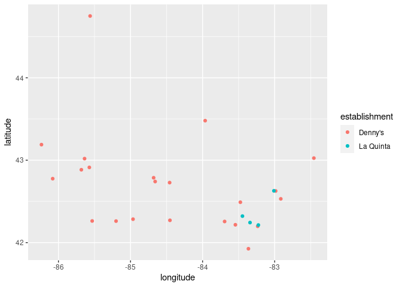
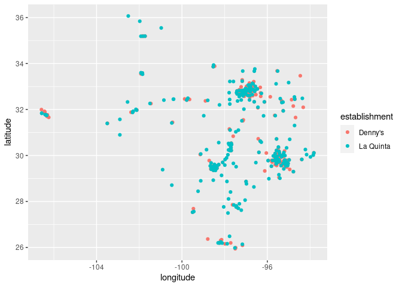

Activity 7
================
Moreen19

## Data and packages

Load the entirety of the `{tidyverse}`. Be sure to avoid printing out
any unnecessary information and give the code chunk a meaningful name.

``` r
library(tidyverse)
```

In this activity we will explore joining information that is contained
in multiple data files. We will also explore ways of visualizing spatial
data.

The late comedian [Mitch
Hedberg](https://en.wikipedia.org/wiki/Mitch_Hedberg) believed that La
Quinta (pronounced la KEEN-ta) was Spanish for “next to Denny’s”.


In the `data` folder, you have been provided with three `.csv` files.
The `dennys.csv` and `laquinta.csv` files contains addresses for the
locations of each respective company. The `states.csv` file contains the
area (thousand square miles) for each US state and the District of
Columbia. These data were scrapped from
[Denny’s](https://locations.dennys.com/) and [La
Quinta’s](https://www.wyndhamhotels.com/laquinta/locations) location web
pages by Mine Çetinkaya-Rundel.

Read each of the three files using `here::here` in combination with the
appropriate `{readr}` function. Assign each file to a meaningful object
name (e.g., `dennys`,`laquinta`, and `states`), be sure to avoid
printing any unnecessary information. Give your code chunk a meaningful
name.

``` r
dennys <- read_csv(here::here("data/dennys.csv"))
laquinta <- read_csv(here::here("data/laquinta.csv"))
states <- read_csv(here::here("data/states.csv"))
```

### Provide more information

`class`, `str`, `nrow`, `ncol`, and `names` are extremely helpful
functions for quickly getting information about a dataset. Below is a
brief summary of the information that each function provides.

-   `class`: Returns the attribute of the R object
-   `str`: A compact display of the internal structure of an R object.
    This can also be viewed by clicking on the blue circle icon next to
    the R object in the **Environment** pane (upper-right pane).
-   `nrow`: Returns the number of rows in an R object
-   `ncol`: Returns the number of columns in an R object
-   `names`: Get or set the names of an R object (e.g., the column names
    for a dataset)

Use the output from `str` of these datasets to complete the `Type`
column in the partially started data dictionary tables below.

``` r
str(dennys)
```

    ## spec_tbl_df [1,643 × 6] (S3: spec_tbl_df/tbl_df/tbl/data.frame)
    ##  $ address  : chr [1:1643] "2900 Denali" "3850 Debarr Road" "1929 Airport Way" "230 Connector Dr" ...
    ##  $ city     : chr [1:1643] "Anchorage" "Anchorage" "Fairbanks" "Auburn" ...
    ##  $ state    : chr [1:1643] "AK" "AK" "AK" "AL" ...
    ##  $ zip      : chr [1:1643] "99503" "99508" "99701" "36849" ...
    ##  $ longitude: num [1:1643] -149.9 -149.8 -147.8 -85.5 -86.8 ...
    ##  $ latitude : num [1:1643] 61.2 61.2 64.8 32.6 33.6 ...
    ##  - attr(*, "spec")=
    ##   .. cols(
    ##   ..   address = col_character(),
    ##   ..   city = col_character(),
    ##   ..   state = col_character(),
    ##   ..   zip = col_character(),
    ##   ..   longitude = col_double(),
    ##   ..   latitude = col_double()
    ##   .. )

``` r
str(laquinta)
```

    ## spec_tbl_df [909 × 6] (S3: spec_tbl_df/tbl_df/tbl/data.frame)
    ##  $ address  : chr [1:909] "793 W. Bel Air Avenue" "3018 CatClaw Dr" "3501 West Lake Rd" "184 North Point Way" ...
    ##  $ city     : chr [1:909] "\nAberdeen" "\nAbilene" "\nAbilene" "\nAcworth" ...
    ##  $ state    : chr [1:909] "MD" "TX" "TX" "GA" ...
    ##  $ zip      : chr [1:909] "21001" "79606" "79601" "30102" ...
    ##  $ longitude: num [1:909] -76.2 -99.8 -99.7 -84.7 -96.6 ...
    ##  $ latitude : num [1:909] 39.5 32.4 32.5 34.1 34.8 ...
    ##  - attr(*, "spec")=
    ##   .. cols(
    ##   ..   address = col_character(),
    ##   ..   city = col_character(),
    ##   ..   state = col_character(),
    ##   ..   zip = col_character(),
    ##   ..   longitude = col_double(),
    ##   ..   latitude = col_double()
    ##   .. )

``` r
str(states)
```

    ## spec_tbl_df [51 × 3] (S3: spec_tbl_df/tbl_df/tbl/data.frame)
    ##  $ name        : chr [1:51] "Alabama" "Alaska" "Arizona" "Arkansas" ...
    ##  $ abbreviation: chr [1:51] "AL" "AK" "AZ" "AR" ...
    ##  $ area        : num [1:51] 52420 665384 113990 53179 163695 ...
    ##  - attr(*, "spec")=
    ##   .. cols(
    ##   ..   name = col_character(),
    ##   ..   abbreviation = col_character(),
    ##   ..   area = col_double()
    ##   .. )

#### Denny’s data

| Variable    | Type | Brief description                 |
|-------------|------|-----------------------------------|
| `address`   | chr  | street address of dennys location |
| `city`      | chr  | city of dennys location           |
| `state`     | chr  | state of dennys location          |
| `zip`       | chr  | zip code of dennys location       |
| `longitude` | num  | east-west position on Earth       |
| `latitude`  | num  | north-south position on Earth     |

#### La Quinta’s data

| Variable    | Type | Brief description                   |
|-------------|------|-------------------------------------|
| `address`   | chr  | street address of laquinta location |
| `city`      | chr  | city of laquinta location           |
| `state`     | chr  | state of laquinta location          |
| `zip`       | chr  | zip code of laquinta location       |
| `longitude` | num  | east-west position on Earth         |
| `latitude`  | num  | north-south position on Earth       |

#### States data

| Variable       | Type | Brief description             |
|----------------|------|-------------------------------|
| `name`         | chr  | state name                    |
| `abbreviation` | chr  | state abbreviation            |
| `area`         | dbl  | area in thousand square miles |

 **Planned Pause Point**: If you have any
questions, contact your instructor. Otherwise feel free to continue on.

## Analysis

### Locations in the US

We will limit our analysis to Denny’s and La Quinta’s locations within
the United States Look at the websites that the data come from (linked
above). Are there any La Quinta’s locations outside of the US? What
about Denny’s?

**Response**: La Quinta has some locations outside the US eg in China,
Canada,Mexico, Honduras etc Denny’s has locations only in the US.

If we wanted to do this using the datasets, would we need to ? Don’t
worry about implementing this yet, you only need to brainstorm some
ideas. Include at least one idea as your answer, but you are welcome to
write down a few options too.

**Response**:We would filter out the locations within the united states.

### Preparing to Join

#### Denny’s

Now we will find the Denny’s locations that are outside the US using
code. To do so, *filter* the Denny’s locations for observations where
state is *not in* `states$abbreviation`. Do not assign this to anything;
we only want to see if we need to be aware of non-US cases. If there are
any non-US locations, specify where these are.

``` r
filter(dennys, !state %in% states$abbreviation)
```

    ## # A tibble: 0 x 6
    ## # … with 6 variables: address <chr>, city <chr>, state <chr>, zip <chr>,
    ## #   longitude <dbl>, latitude <dbl>

**Response**: There are no locations outside the US.

Now do this again, but using `anti_join`. To do so, take the Denny’s
locations and anti-join this with the states dataset. Remember to
specify your `by` columns.

``` r
dennys %>%
  anti_join(states, by = c("state"="abbreviation"))
```

    ## # A tibble: 0 x 6
    ## # … with 6 variables: address <chr>, city <chr>, state <chr>, zip <chr>,
    ## #   longitude <dbl>, latitude <dbl>

#### A Brief Aside

Another way to do this would be to create a new variable (called, says,
`country`), then filter on this new variable. Remember that `mutate`
creates new variables. Then `dplyr::case_when` function is a nice way to
do multiple if-else statements. For example, your instructor could see
if there are any Denny’s in any the states that your instructor has
lived in:

``` r
dennys %>%
  mutate(bradford_lived = case_when(
    state %in% c("MI", "NC", "IL", "ME") ~ "Yes",
    TRUE ~ "No"))
```

    ## # A tibble: 1,643 x 7
    ##    address             city        state zip   longitude latitude bradford_lived
    ##    <chr>               <chr>       <chr> <chr>     <dbl>    <dbl> <chr>         
    ##  1 2900 Denali         Anchorage   AK    99503    -150.      61.2 No            
    ##  2 3850 Debarr Road    Anchorage   AK    99508    -150.      61.2 No            
    ##  3 1929 Airport Way    Fairbanks   AK    99701    -148.      64.8 No            
    ##  4 230 Connector Dr    Auburn      AL    36849     -85.5     32.6 No            
    ##  5 224 Daniel Payne D… Birmingham  AL    35207     -86.8     33.6 No            
    ##  6 900 16th St S, Com… Birmingham  AL    35294     -86.8     33.5 No            
    ##  7 5931 Alabama Highw… Cullman     AL    35056     -86.9     34.2 No            
    ##  8 2190 Ross Clark Ci… Dothan      AL    36301     -85.4     31.2 No            
    ##  9 900 Tyson Rd        Hope Hull … AL    36043     -86.4     32.2 No            
    ## 10 4874 University Dr… Huntsville  AL    35816     -86.7     34.7 No            
    ## # … with 1,633 more rows

`case_when` looks to see if any of the `dennys$state`s are in the vector
of state abbreviations that I have lived (i.e.,
`c("MI", "NC", "IL", "ME")`). If this is a `TRUE` statement, then
`bradford_lived` will be set to `"Yes"`. Otherwise, if the values is not
a missing value (i.e., `NA`), the `TRUE ~ "NO"` line sets
`bradford_lived` to `"No`. If the values are missing, they remain
missing in `bradford_lived`. Without the `TRUE ~ "No"` line, all values
except for “MI”, “NC”, “IL”, and “ME” would be set to missing values.

Note that we could have also used
`!(state %in% c("MI", "NC", "IL", "ME")) ~ "NO"`. However, this would be
slightly inefficient to type as `TRUE ~ "No"` captures this.

To create a new variable called `country` where if the state is in the
US, `country` is set to `"United States"` we would then do:

``` r
dennys %>% 
  mutate(country = case_when(
    state %in% states$abbreviation ~ "United States",
    TRUE ~ "Other")) %>% 
  filter(country != "Other")
```

    ## # A tibble: 1,643 x 7
    ##    address                city         state zip   longitude latitude country   
    ##    <chr>                  <chr>        <chr> <chr>     <dbl>    <dbl> <chr>     
    ##  1 2900 Denali            Anchorage    AK    99503    -150.      61.2 United St…
    ##  2 3850 Debarr Road       Anchorage    AK    99508    -150.      61.2 United St…
    ##  3 1929 Airport Way       Fairbanks    AK    99701    -148.      64.8 United St…
    ##  4 230 Connector Dr       Auburn       AL    36849     -85.5     32.6 United St…
    ##  5 224 Daniel Payne Driv… Birmingham   AL    35207     -86.8     33.6 United St…
    ##  6 900 16th St S, Common… Birmingham   AL    35294     -86.8     33.5 United St…
    ##  7 5931 Alabama Highway,… Cullman      AL    35056     -86.9     34.2 United St…
    ##  8 2190 Ross Clark Circle Dothan       AL    36301     -85.4     31.2 United St…
    ##  9 900 Tyson Rd           Hope Hull (… AL    36043     -86.4     32.2 United St…
    ## 10 4874 University Drive  Huntsville   AL    35816     -86.7     34.7 United St…
    ## # … with 1,633 more rows

 **Planned Pause Point**: If you have any
questions, contact your instructor. Otherwise feel free to continue on.

#### La Quinta

Determine if La Quinta has any locations that are outside of the US.

``` r
laquinta %>%
  anti_join(states, by = c("state"= "abbreviation"))
```

    ## # A tibble: 14 x 6
    ##    address                     city               state zip   longitude latitude
    ##    <chr>                       <chr>              <chr> <chr>     <dbl>    <dbl>
    ##  1 Carretera Panamericana Sur… "\nAguascalientes" AG    20345    -102.     21.8 
    ##  2 Av. Tulum Mza. 14 S.M. 4 L… "\nCancun"         QR    77500     -86.8    21.2 
    ##  3 Ejercito Nacional 8211      "Col\nPartido Igl… CH    32528    -106.     31.7 
    ##  4 Blvd. Aeropuerto 4001       "Parque Industria… NL    66600    -100.     25.8 
    ##  5 Carrera 38 # 26-13 Avenida… "\nMedellin Colom… ANT   0500…     -75.6     6.22
    ##  6 AV. PINO SUAREZ No. 1001    "Col. Centro\nMon… NL    64000    -100.     25.7 
    ##  7 Av. Fidel Velazquez #3000 … "\nMonterrey"      NL    64190    -100.     25.7 
    ##  8 63 King Street East         "\nOshawa"         ON    L1H1…     -78.9    43.9 
    ##  9 Calle Las Torres-1 Colonia… "\nPoza Rica"      VE    93210     -97.4    20.6 
    ## 10 Blvd. Audi N. 3 Ciudad Mod… "\nSan Jose Chiap… PU    75010     -97.8    19.2 
    ## 11 Ave. Zeta del Cochero No 4… "Col. ReservaTerr… PU    72810     -98.2    19.0 
    ## 12 Av. Benito Juarez 1230 B (… "\nSan Luis Potos… SL    78399    -101.     22.1 
    ## 13 Blvd. Fuerza Armadas        "contiguo Mall La… FM    11101     -87.2    14.1 
    ## 14 8640 Alexandra Rd           "\nRichmond"       BC    V6X1…    -123.     49.2

#### Isolating US locations

For the rest of this activity, we will work with the data from the
United States *only*. All Denny’s locations in our file are in the US so
we do not need to worry about updating this object, but you do need to
do some work on the `laquinta` data. Create a new object called
`laquinta_us` that only contains the locations inside the US.

``` r
laquinta_us <-laquinta %>%
  filter(state %in% states$abbreviation)
laquinta_us 
```

    ## # A tibble: 895 x 6
    ##    address                         city           state zip   longitude latitude
    ##    <chr>                           <chr>          <chr> <chr>     <dbl>    <dbl>
    ##  1 793 W. Bel Air Avenue           "\nAberdeen"   MD    21001     -76.2     39.5
    ##  2 3018 CatClaw Dr                 "\nAbilene"    TX    79606     -99.8     32.4
    ##  3 3501 West Lake Rd               "\nAbilene"    TX    79601     -99.7     32.5
    ##  4 184 North Point Way             "\nAcworth"    GA    30102     -84.7     34.1
    ##  5 2828 East Arlington Street      "\nAda"        OK    74820     -96.6     34.8
    ##  6 14925 Landmark Blvd             "\nAddison"    TX    75254     -96.8     33.0
    ##  7 909 East Frontage Rd            "\nAlamo"      TX    78516     -98.1     26.2
    ##  8 2116 Yale Blvd Southeast        "\nAlbuquerqu… NM    87106    -107.      35.1
    ##  9 7439 Pan American Fwy Northeast "\nAlbuquerqu… NM    87109    -107.      35.2
    ## 10 2011 Menaul Blvd Northeast      "\nAlbuquerqu… NM    87107    -107.      35.1
    ## # … with 885 more rows

### Fewest locations

Let’s test some of our data summary skills.

Which US state(s) has/ve the fewest Denny’s location?

``` r
dennys %>%
group_by(state) %>%
summarise(total_per_state = n()) %>%
arrange(total_per_state)  
```

    ## # A tibble: 51 x 2
    ##    state total_per_state
    ##    <chr>           <int>
    ##  1 DE                  1
    ##  2 DC                  2
    ##  3 VT                  2
    ##  4 AK                  3
    ##  5 IA                  3
    ##  6 NH                  3
    ##  7 SD                  3
    ##  8 WV                  3
    ##  9 LA                  4
    ## 10 MT                  4
    ## # … with 41 more rows

**Response**: DE ,DC and VT have the lowest number of locations.

Which US state(s) has/ve the fewest La Quinta locations?

``` r
laquinta_us %>%
group_by(state) %>%
summarise(count = n()) %>%
arrange(count)
```

    ## # A tibble: 48 x 2
    ##    state count
    ##    <chr> <int>
    ##  1 ME        1
    ##  2 AK        2
    ##  3 NH        2
    ##  4 RI        2
    ##  5 SD        2
    ##  6 VT        2
    ##  7 WV        3
    ##  8 WY        3
    ##  9 IA        4
    ## 10 MI        4
    ## # … with 38 more rows

**Response**: Maine

Is this surprising to you? Why or why not?

**Response**:

### Locations per thousand square miles

Next we will calculate which states have the most Denny’s and La Quinta
locations per thousand square miles. To do this, we will need to join
each company’s tibble with the information in the `states` tibble.

#### Denny’s

1.  Take the `dennys` tibble and determine how many observations are in
    each state. This should have two columns: `state` and `n`.
2.  *Then*, use `inner_join` to join the previous information to the
    `states` tibble. Note that the variables in the `states` tibble has
    the two letter abbreviations in a column called `abbreviation`.
    Therefore, we will need to specify that the `state` variable from
    the `dennys` tibble should be matched `by` the `abbreviation`
    variable from the `states` tibble.
3.  *Then*, calculate the number of Denny’s locations *per* thousand
    square miles.

``` r
dennys %>%
group_by(state) %>%
summarise(count = n()) %>%
inner_join(states, by = c("state" = "abbreviation")) %>%
mutate(denny_loc_tsm = (count/area)*1000) %>%
arrange(desc(denny_loc_tsm))
```

    ## # A tibble: 51 x 5
    ##    state count name                     area denny_loc_tsm
    ##    <chr> <int> <chr>                   <dbl>         <dbl>
    ##  1 DC        2 District of Columbia     68.3        29.3  
    ##  2 RI        5 Rhode Island           1545.          3.24 
    ##  3 CA      403 California           163695.          2.46 
    ##  4 CT       12 Connecticut            5543.          2.16 
    ##  5 FL      140 Florida               65758.          2.13 
    ##  6 MD       26 Maryland              12406.          2.10 
    ##  7 NJ       10 New Jersey             8723.          1.15 
    ##  8 NY       56 New York              54555.          1.03 
    ##  9 IN       37 Indiana               36420.          1.02 
    ## 10 OH       44 Ohio                  44826.          0.982
    ## # … with 41 more rows

Which states have the most Denny’s locations per thousand square miles?

**Response**: District of Columbia, Rhode Island,California.

#### La Quinta

Similarly as we previously did for Denny’s, calculate the number of La
Quinta locations *per* thousand square miles.

``` r
laquinta_us %>%  
group_by(state)%>%
summarise(count = n())%>%
inner_join(states, by = c("state"="abbreviation"))%>%
mutate( laquinta_loc_tsm = (count/area)*1000)%>%
arrange(desc(laquinta_loc_tsm))
```

    ## # A tibble: 48 x 5
    ##    state count name             area laquinta_loc_tsm
    ##    <chr> <int> <chr>           <dbl>            <dbl>
    ##  1 RI        2 Rhode Island    1545.            1.29 
    ##  2 FL       74 Florida        65758.            1.13 
    ##  3 CT        6 Connecticut     5543.            1.08 
    ##  4 MD       13 Maryland       12406.            1.05 
    ##  5 TX      237 Texas         268596.            0.882
    ##  6 TN       30 Tennessee      42144.            0.712
    ##  7 GA       41 Georgia        59425.            0.690
    ##  8 NJ        5 New Jersey      8723.            0.573
    ##  9 MA        6 Massachusetts  10554.            0.568
    ## 10 LA       28 Louisiana      52378.            0.535
    ## # … with 38 more rows

**Response**:

Rhode island, Florida.


<b>Planned Pause Point</b>: If you feel that you have a good
understanding of these commands, feel free to start working on your
project. The remainder of this activity will deal with creating map data
visualizations.

### Mapping locations

To be able to map all of the `dennys` and `laquinta` locations, we
should combine them into one dataset.

Both of these tibbles have the same columns in the same order (i.e.,
`address`, `city`, `state`, `zip`, `longitude`, `latitude`, `country`)
so we can simply stack them on top of each other by using `bind_rows`.

Why would it not be wise to use a mutating join (e.g., `inner_join`,
`left/right_join`, `full_join`) for these data? That is, both of the
datasets have the same variable names, would it not make sense to join
them at the same address?

**Response**: The rows contain specific locations.

If we were able to use a mutating join, what would this output would
look like? Why would this not be helpful?

**Response**:

You were already shown these top-notch animations from [Garrick
Aden-Blue](https://www.garrickadenbuie.com/project/tidyexplain/). Again,
they are a little old as they still use `spread` and `gather`, but the
`*_join` are still accurate.

Prior to combining these datasets, it would be nice to know which
company each location belongs to.

``` r
pre_join_dennys <- dennys %>% 
  mutate(establishment = "Denny's")

pre_join_laquinta_us <- laquinta_us %>% 
  mutate(establishment = "La Quinta")
```

Now, stack these two `pre_join_*` tibbles on top of each other. After
you have verified the stacking worked, assign the resulting object to
`dennys_laquinta`.

``` r
dennys_laquinta <- bind_rows(pre_join_dennys, pre_join_laquinta_us)
```

We can plot the locations of the two establishments using a scatter plot
and color the points by the establishment type. Note that longitude
should be plotted on the *x*-axis and latitude on the *y*-axis.

``` r
ggplot(dennys_laquinta)+
  geom_point(aes(x = longitude, y = latitude, colour = establishment))
```

<!-- -->

**Response**: The central region has fewer dennys and laquinta
locations.

### More with visualizing

The following two items ask you to create visualizations. These should
follow best practices such as informative titles, axis labels, etc. See
<http://ggplot2.tidyverse.org/reference/labs.html> for help with the
syntax.

You can also choose different themes to change the overall look of your
plots. See <http://ggplot2.tidyverse.org/reference/ggtheme.html> for
help with these.

The general idea here is that create the map using a dataset of shape
files, then overlay a layer of points using a different dataset.

Note that [choropleth
maps](https://r-charts.com/spatial/choropleth-map-ggplot2/) are slightly
different in that you would need to joining the shape file and the data
containing ammounts to shade each shape.

#### Michigan locations

Filter the data for observations in Michigan only, and create a plot.
Try adjusting the transparency of the points by setting the `alpha`
level (so that it is easier to see the over-plotted ones). Visually,
does Mitch Hedberg’s joke appear to hold in Michigan?

``` r
dennys_laquinta%>%
  filter(state == "MI")%>%
  ggplot(aes(x = longitude, y = latitude, color = establishment))+
  geom_point()
```

<!-- -->

**Response**:

#### Texas locations

Now filter the data for observations in Texas only. Create the plot,
with an appropriate `alpha` level. Visually, does Mitch Hedberg’s joke
appear to hold here?

``` r
dennys_laquinta%>%
  filter(state == "TX")%>%
  ggplot(aes(x = longitude, y = latitude, color = establishment))+
  geom_point()
```

<!-- -->

**Response**:

### Challenge: Dress up your maps

Hadley’s [ggplot2](https://ggplot2-book.org/maps.html) text shows how to
use the `geom_polygon` and `coord_quickmap` layers to create state
outlines when plotting spatial data.

This blog post series on **r-spatial** goes into a lot more detail for
dressing up maps:

-   [Basics](https://www.r-spatial.org/r/2018/10/25/ggplot2-sf.html)
-   [Layers](https://www.r-spatial.org/r/2018/10/25/ggplot2-sf-2.html)
-   [Layout](https://www.r-spatial.org/r/2018/10/25/ggplot2-sf-3.html)

Add state boundaries to each of your maps. Do this within each of the
previous code chunks.

 **Planned Pause Point**: If you have any
questions, contact your instructor. Otherwise feel free to continue on.

## Attribution

Inspiration for this Activity was provided by [Mine
Çetinkaya-Rundel](http://www2.stat.duke.edu/courses/Spring18/Sta199/).
